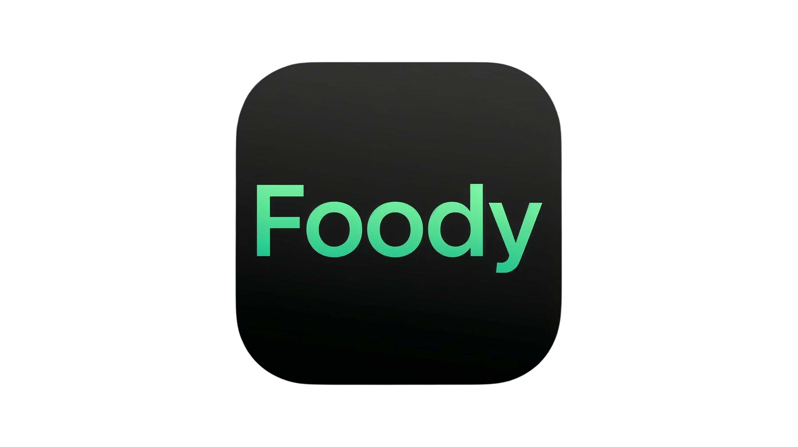

# 🍽️ Foody

[](https://flutter.dev)
[](https://dart.dev)
[](LICENSE)

<div align="center">
  
  
  *Your AI-powered food analysis companion*
</div>

## 📱 Overview

Foody is a sophisticated Flutter application that combines image analysis with health metrics tracking. Built with modern architecture patterns and best practices, it provides users with an intuitive interface for managing their health-related data and food analysis.

## ✨ Features

### 🎯 Core Features
- 📸 Advanced image analysis
- 📊 Health metrics tracking
- 📈 Interactive data visualization
- 🔒 Secure data persistence
- 🌙 Modern Material Design UI

### 🛠️ Technical Features
- Clean Architecture with MVVM pattern
- Dependency Injection
- State Management
- Environment Configuration
- Responsive Design

## 🚀 Getting Started

### Prerequisites

- Flutter SDK (>=2.18.0)
- Dart SDK
- Android Studio / Xcode
- VS Code (recommended)

### Installation

1. **Clone the repository**
   ```bash
   git clone [repository-url]
   cd foody
   ```

2. **Install dependencies**
   ```bash
   flutter pub get
   ```

3. **Configure environment**
   - Create `.env` file in root directory
   - Add required environment variables

4. **Run the app**
   ```bash
   flutter run
   ```

## 🛠️ Tech Stack

### Core
- **Framework**: Flutter
- **Language**: Dart
- **Architecture**: Clean Architecture + MVVM

### State Management & DI
- Provider
- GetIt

### Storage & Network
- Shared Preferences
- HTTP Client

### UI Components
- Flutter SpinKit
- Google Fonts
- FL Chart
- Shimmer

## 🤝 Contributing

We welcome contributions! Please follow these steps:

1. Fork the repository
2. Create your feature branch (`git checkout -b feature/AmazingFeature`)
3. Commit your changes (`git commit -m 'Add some AmazingFeature'`)
4. Push to the branch (`git push origin feature/AmazingFeature`)
5. Open a Pull Request

## 📝 License

This project is licensed under the terms of the license included in the repository.

## 📞 Contact

[](mailto:mohammadaminrez@gmail.com)

---

<div align="center">
  Made with ❤️ by Amin
</div>
